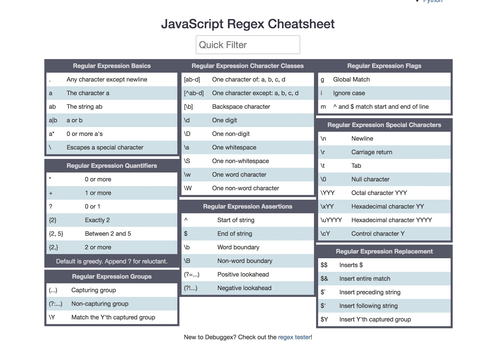

## 正则表达式字符



## 测试
https://regex101.com/
## 可视化
https://www.debuggex.com/

### 转义字符

`.`:任意字符

`\s`：空格
Moombahton
`\S`：非空格

`\d`：数字

`\D`：非数字

`\w`：字符

`\W`：非字符

`\b`:独立部分   （起始，结束，空格）

`\B`:非独立部分


```js
var str=" one two";
var re=/\bone/;
re.test(str);
//true
```

`\1`:重复的第一个子项

```js
/\w\w/ //c9

/(\w)\1/ //cc 99
```


### 符号

当正则需要传参，必须使用完整写法；

    var re=new RegExp('\\b'+str);

`^` :正则的最开始位置，代表起始的意思

`$` :正则的结束位置，代表结束的意思


 - 匹配子项 ： 小括号() 分组操作

```js
var str='2013-6-7';
var re=/(\d+)(-)/g;

var nstr=str.replace(re,function($0,$1,$2){
    console.log($0);
    console.log($1);
    console.log($2);
});
/*
2013-
2013
-
6-
6
-
*/
```
第一个参数是这次匹配被替换的整体，之后的依次是每一个子项。


### 字符类
字符类 ：一组相似的元素 [] 中括号的整体代表一个字符

排除： `^`如果写在`[]`里面，代表排除的意思。

```js
var str='abc';

var re=/a[bde]c/;
var re1=/a[^ssde]c/;
console.log(re.test(str));
console.log(re1.test(str));
//true
//true
```

取出HTMl标签

```js
var str="<h3 style='color:red;'>欢迎光临</h3>";

var re=/<[^>]+>/g;

console.log(str.replace(re,""));
```


## 正则表达式的常用方法

 - test()

`test()`正则去匹配字符串，如果匹配成功就返回真。

```js
> var str='ereww'
undefined
> var re=/e/;
undefined
> re.test(str)
true
```

 - exec()

`exec()`方法在匹配成功后，会返回一个`Array`，第一个元素是正则表达式匹配到的整个字符串，后面的字符串表示匹配成功的子串。

```js
var re = /^(\d{3})-(\d{3,8})$/;
re.exec('010-12345'); // ['010-12345', '010', '12345']
re.exec('010 12345'); // null
```

 - search()


`search()`正则去匹配字符串，如果匹配成功，如果匹配成功就返回成功的位置。失败就返回`-1`。

```js
> var str="we234DFEG";
undefined
> str.search(/df/i);
5
```

`i`标识代表忽略大小写。
`g`标识代表全局匹配。

 - match()

`match()`:正则去匹配字符串，如果匹配成功，就返回成功的数组。不成功就返回`null`。

```js
> var str='12341qwe1243534634';
undefined
> var re=/\d+/g
undefined
> str.match(re)
[ '12341', '1243534634' ]
```

 - replace()

`replace()`：正则去匹配字符串，匹配成功的字符串去替换成新的字符串。

```js
> var str='abcABC';
undefined
> re=/a+/ig
/a+/gi
> str.replace(re,"ppp")
'pppbcpppBC'
//或者可以这样写

> str.replace(re,function(word){
    //有参数，被替换的字符
    return '**';
});
```

### 量词

量词 ：{}

`{4,7}`:最小出现4次，最多出现7次。
`{4,}`:最小出现4次
`{4}`:正好出现4次

`+`:{1,}

`?`:{0,1}

`*`:{0,}

### 贪婪匹配

正则匹配默认是贪婪匹配，也就是匹配尽可能多的字符。

```js
var re = /^(\d+)(0*)$/;
re.exec('102300'); // ['102300', '102300', '']

//非贪婪匹配

var re = /^(\d+?)(0*)$/;
re.exec('102300'); // ['102300', '1023', '00']
```

使用`+?`这样可以非贪婪匹配。

### 元字符

需要加`\`才表示元字符意思的字符：

```js
^ $ ( ) * + ? . [ \ { |
```
