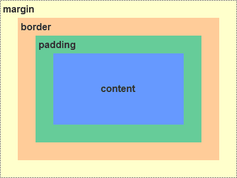
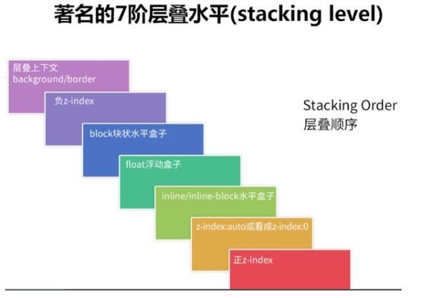

# css
## 盒模型
四要素：margin、border、padding、content


区别：
怪异盒模型总宽度 = content + padding
标准盒模型总宽度 = content

使用：
box-sizing: border-box（怪异盒模型） || content-box（标准盒模型）

## flex
## 单位
rem
em
px

## 选择器
a）、id选择器(#box{})
b）、类选择器(.box{})
c）、属性选择器(a[href="http://www.xxx.com"])
d）、伪类和伪对象选择器(:hoevr{}和::after{})
e）、标签类型选择器(div{})
f）、通配符选择器(*{})

## 权重
1、!important，加在样式属性值后，权重值为 10000
2、内联样式，如：style=””，权重值为1000
3、ID选择器，如：#content，权重值为100
4、类，伪类和属性选择器，如： content、:hover 权重值为10
5、标签选择器和伪元素选择器，如：div、p、:before 权重值为1
6、通用选择器（*）、子选择器（>）、相邻选择器（+）、同胞选择器（~）、权重值为0

## bfc 清除浮动
BFC 就是清除浮动 用来处理文档脱离文档流的问题

伪类清浮动
```css
.clear:after{
    content:"";//给元素添加一个空的内容
    display:block;//让这个空的元素成为一个块元素;
    clear:both;//再让这个元素旁边两侧都不允许浮动
}
```
## 层叠


background/border
—负z-index
——block块状水平盒子
———float浮动盒子
————inline/inline-block盒子
—————z-index:auto或看成z-index:0
——————正z-index

## block inline inline-block
块级元素(block)：独占一行，对宽高的属性值生效；如果不给宽度，块级元素就默认为浏览器的宽度，即就是100%宽。

行内元素(inline)：可以多个标签存在一行，对宽高属性值不生效，完全靠内容撑开宽高。

行内块元素(inline-block)：结合的行内和块级的优点，既可以设置长宽，可以让padding和margin生效，又可以和其他行内元素并排。

float、position:absolute、position:fixed 都会使得原先的行内元素变为块级元素

## 常见页面布局

## 响应式布局
meta标签
```html
<meta name="viewport" content="width=device-width, initial-scale=1, maximum-scale=1, user-scalable=no">
```

媒体查询
```css
@media screen and (max-width: 980px) {
  #head { … }
  #content { … }
  #footer { … }
}
/** iPad **/
@media only screen and (min-width: 768px) and (max-width: 1024px) {}
/** iPhone **/
@media only screen and (min-width: 320px) and (max-width: 767px) {}

```


## 预处理，后处理
## css3新特性 animation和transiton的相关属性animate和translate
## display哪些取值
## 相邻的两个inline-block节点为什么会出现间隔，该如何解决
## meta viewport 移动端适配
## CSS实现宽度自适应100%，宽高16:9的比例的矩形
## rem布局的优缺点
## 画三角形
## 1像素边框问题


